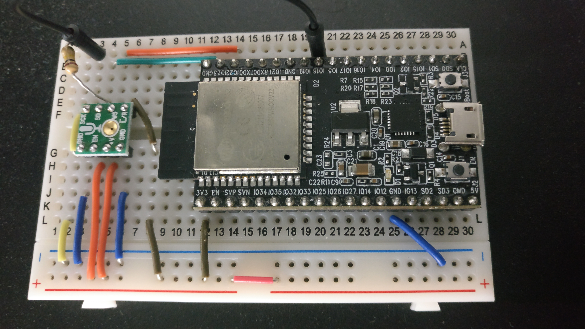

# ESP32 AES67 audio over IP (over WiFi) trial prototype application

This is a experimental application which aims to send audio packets via WiFi, while following the AES67 audio-over-IP requirements.

You need a [ESP-IDF](https://github.com/espressif/esp-idf) installed to your host computer.

## Results for now

AES67 L16 48kHz requires to send RTP packets every 1000 _micro_ seconds when sending 48 samples per packet, but I acheived only about 1050 microseconds for now.

## What you need

- the latest [ESP-IDF](https://github.com/espressif/esp-idf)
- ESP32(WROOM-32)
  - I am using the [ESP32-DevKitC](https://www.espressif.com/en/products/hardware/esp32-devkitc/overview)
  - You may build your own board if you want to. We will use the 3v3 output so leave that.
- Some I2S input. Files are created for;
  - [ADMP441](https://www.analog.com/en/products/admp441.html): microphone, Working
  - [SPH0645](https://www.adafruit.com/product/3421): microphone, NOT working
  - [PCM1808](http://m.ti.com/product/pcm1808): ADC, NOT working

## Setup

### Hardware Setup

An example setup for ADMP441.



Find the lines like these in `main.c` or whatever file you use.

```c
i2s_pin_config_t pin_config = {
    .bck_io_num = GPIO_NUM_18,
    .ws_io_num = GPIO_NUM_22,
    .data_in_num = GPIO_NUM_23,
    .data_out_num = I2S_PIN_NO_CHANGE // not used
};
```

connect the corresponding pins on the I2S device to the pin you set above.
This settings may be changeable via `idf.py menuconfig` someday.

### Software Setup

1. Make sure you have ESP-IDF correctly installed, and is useable in your shell's path. Install the latest version (or at least v3.1).  
   Install Ninja if you can, the compile process will be faster.
1. Do `cp main/config/cmake_config.sample.txt main/config/cmake_config.txt`
1. Edit `main/config/cmake_config.txt`'s `set(MainFile "{filename}")` to set which source C file to use. (e.g. `'main/ADMP441/main-dualcore.c'`, filename should be the relative path from the project root)
1. Do `$ cp sdkconfig.sample sdkconfig` to copy recommended configs.
1. Run `idf.py menuconfig`. Under `Project Configuration`, set your Wi-Fi AP, and the receiver's address and the port to send the UDP packets.
1. Run `idf.py -p /dev/ttyUSB0 flash monitor` to flash and monitor. This compiles the sources too.
1. (Run `idf.py -p /dev/ttyUSB0 monitor` if you don't need to flash.)

If an error occurs during compilation, check if you have ESP-IDF correctly installed, or, check `idf.py menuconfig` (or the `sdkconfig` file directly) and see for example if your Serial port is configured correctly.

## Links
- The old one (which acheived only over 2ms)  
  https://github.com/sfc-arch/esp32_aes67_sender
- ~~The receiver (this becomes a AP itself too), not working well~~  
  ~~https://github.com/sfc-arch/esp32_aes67_receiver~~
- The receiver for PCs
  - The new one (written in Rust, better sound, can be run as binary)  
    https://github.com/ndac-todoroki/rtp_jyushin_maru
  - The old one (Elixir, you need Elixir installed to run, audio drops but latency is lower)  
    https://github.com/ndac-todoroki/PacketJyushinMaru
